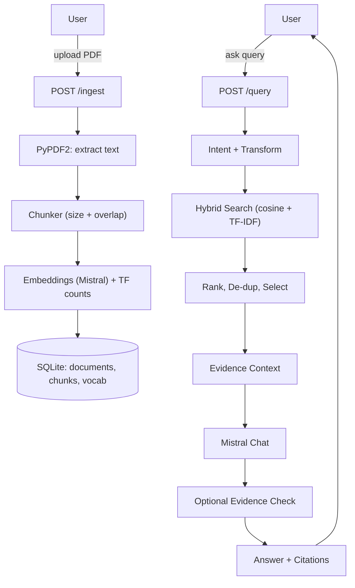

# 📚 LLM-RAG: Retrieval-Augmented Generation Mini-Pipeline

A lightweight RAG system built with **FastAPI**, **Mistral API**, and **SQLite**.  
Upload PDFs, index them (semantic + keyword), and ask questions via a minimal web UI with strict citations.

Deployed on **Hugging Face Spaces** (Docker) and runnable **locally**.

---
UI Demo (Hugging Face Space): https://huggingface.co/spaces/MichelleHF/LLM-Rag 

--- 

## ✨ Features

- **Data Ingestion**  
  Upload one or more PDFs (`POST /ingest`). Extract text (PyPDF2), normalize whitespace, chunk with overlap, embed with Mistral, and store chunks/embeddings/TF counts in **SQLite**.  
  Deduplication is handled via SHA-256 file hashes.

- **Query Processing**  
  Greeting/smalltalk detection, policy gate (PII/legal/medical), light query transform, and **RRF** merge of original vs normalized queries.

- **Hybrid Retrieval**  
  Cosine similarity over Mistral embeddings + TF-IDF keyword signal.  
  Scores blended with configurable weight, then re-ranked and deduplicated.

- **Post-processing**  
  Top-K selection with similarity threshold → *“insufficient evidence”* if not met.  
  Evidence builder with inline citations `[C1]`, `[C2]`.  
  Optional **evidence check** to drop low-support sentences.

- **Answer Generation**  
  Mistral Chat with prompt templates (default, list, table).  
  Always cites evidence; refuses unsupported answers.

- **UI**  
  Minimal HTML/JS served at `/ui` for PDF upload and chat.

---

## 🏗️ System Design


---

## 🚀 Quickstart

### Run Locally

#### 1. Create virtual environment
```bash
python -m venv .venv && source .venv/bin/activate
```

#### 2. Install dependencies
```bash
pip install -r requirements.txt
```

#### 3. Set your Mistral API key
```bash
export MISTRAL_API_KEY=YOUR_KEY
```
Replace YOUR_KEY with your personal API key.
Do not commit secrets to GitHub.

#### 4. Launch the FastAPI app
```bash
uvicorn app.main:app --reload
```
Open [http://localhost:8000/ui](http://localhost:8000/ui) in your browser to upload PDFs and chat with the system.

### Deploy on Hugging Face Spaces (Docker)
- Set repository secret: `MISTRAL_API_KEY`  
- Space type: **Docker**  
- The container automatically runs:
  ```bash
  uvicorn app.main:app --host 0.0.0.0 --port $PORT

## 📐 Design Considerations

### Chunking
- ~1200 characters per chunk, 200 overlap.  
  Larger chunks = coherence but weaker keyword recall.  
  Smaller chunks = recall but fragmented meaning.  
  Overlap prevents context loss.

### Hybrid Retrieval
- **Semantic**: cosine similarity via `mistral-embed`.  
- **Keyword**: TF-IDF ensures exact matches matter.  
- **Blended**: weighted hybrid score + **RRF** for query variants.

### Threshold Refusal
- Applies a similarity gate.  
- If no chunk passes, the system outputs *“insufficient evidence”*.

### Answer Shaping
- Prompt templates: default, bulleted list, or markdown table.  
- Inline citations `[C1]`, `[C2]` are mandatory.

### Hallucination Control
- Optional evidence filter (`ENABLE_EVIDENCE_CHECK=1`) keeps only supported sentences.  
- Policy gate blocks unsafe queries (PII, medical, legal).

---

## 📚 Libraries & References

- [**FastAPI**](https://fastapi.tiangolo.com/) — web framework for endpoints  
- [**Uvicorn**](https://www.uvicorn.org/) — ASGI server  
- [**PyPDF2**](https://pypi.org/project/PyPDF2/) — PDF parsing  
- [**SQLite**](https://www.sqlite.org/index.html) — persistence for docs, chunks, embeddings  
- [**NumPy**](https://numpy.org/) — vector math  
- [**Mistral Python SDK (`mistralai`)**](https://github.com/mistralai/client-python)  
  - [Chat API](https://docs.mistral.ai/platform/endpoints/chat/)  
  - [Embeddings API](https://docs.mistral.ai/capabilities/embeddings/overview/)  

---
