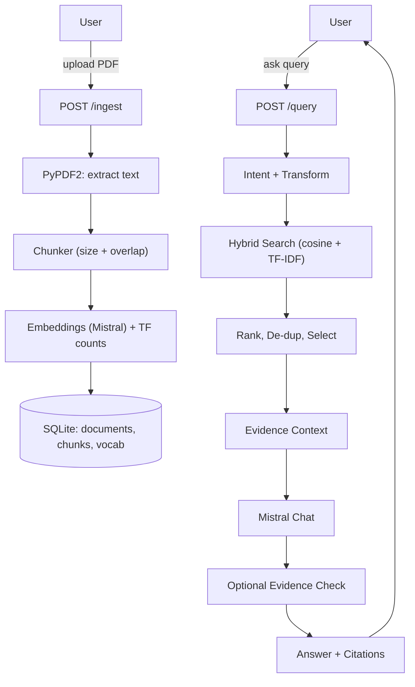

# 📚 LLM-RAG: Retrieval-Augmented Generation Mini-Pipeline

A lightweight RAG system built with **FastAPI**, **Mistral API**, and **SQLite**.  
Upload PDFs, index them (semantic + keyword), and ask questions via a minimal web UI with strict citations.

Deployed on **Hugging Face Spaces** (Docker) and runnable **locally**.

---

## ✨ Features

- **Data Ingestion**
  - `POST /ingest` accepts one or more PDFs.
  - Extracts text with PyPDF2, normalizes whitespace, chunks with overlap, embeds with Mistral.
  - Stores chunks, embeddings (as JSON), and TF counts in **SQLite** (no external vector DB).
  - Deduplicates by SHA-256 file hash.

- **Query Processing**
  - Smalltalk gate (“hello” etc.) and policy gate (PII/legal/medical).
  - Light query transform + **RRF** merge of original/normalized queries.

- **Hybrid Retrieval**
  - **Cosine** similarity over Mistral embeddings + **TF-IDF** keyword signal.
  - Weighted hybrid score, re-rank, de-duplicate.

- **Post-processing**
  - Adaptive selection (use all chunks for tiny corpora; otherwise top-K).
  - Evidence context builder with inline citation tags `[C1]`, `[C2]`, …
  - Optional post-hoc **evidence check** (toggle via env var) to keep only well-cited sentences.

- **Answer Generation**
  - **Mistral Chat** (e.g., `mistral-small`) with prompt templates (default/list/table).
  - Returns **“insufficient evidence”** when similarity falls below a threshold or nothing supports the claim.

- **UI**
  - `GET /ui` serves a simple HTML/JS chat: upload PDFs, ask questions, see citations.

---

## 🏗️ System Design


---

## 🚀 Quickstart

### Run Locally

# 1. Create virtual environment
python -m venv .venv && source .venv/bin/activate

# 2. Install dependencies
pip install -r requirements.txt

# 3. Set your Mistral API key
export MISTRAL_API_KEY=YOUR_KEY

# 4. Launch the FastAPI app
uvicorn main:app --reload
Open [http://localhost:8000/ui](http://localhost:8000/ui) in your browser to upload PDFs and chat with the system.

### Deploy on Hugging Face Spaces (Docker)
- Set repository secret: `MISTRAL_API_KEY`  
- Space type: **Docker**  
- The container automatically runs:
  ```bash
  uvicorn main:app --host 0.0.0.0 --port $PORT

## 📐 Design Considerations

### Chunking
- **Size & overlap**: We use ~1200 characters per chunk with 200 overlap.  
  - Larger chunks → better semantic coherence but weaker keyword specificity.  
  - Smaller chunks → better recall for keywords but fragmented meaning.  
  - Overlap ensures context isn’t lost across chunk boundaries.
- **Alternative strategies**: Sentence-aware or token-aware splitting could improve precision but add complexity.

### Hybrid Retrieval
- **Semantic embeddings**: Capture meaning via cosine similarity over `mistral-embed`.  
- **Keyword scoring**: TF-IDF ensures exact matches matter.  
- **Blended score**: A weighted combination balances precision and recall.  
- **RRF fusion**: Combines original vs transformed queries for robustness.

### Threshold Refusal
- A **similarity threshold** is applied.  
- If top-k evidence doesn’t meet it, the system returns *“insufficient evidence”*.  
- This prevents unsupported answers.

### Answer Shaping
- Prompt templates adapt style: default narrative, bulleted list, or markdown table.  
- Inline citations `[C1]`, `[C2]` are mandatory for each claim.

### Hallucination Control
- Optional post-hoc filter (toggle with `ENABLE_EVIDENCE_CHECK=1`) drops sentences without clear citation support.  
- Policy gate refuses unsafe queries (PII, medical, legal).

---

## 📚 Libraries & References

This project avoids external RAG/search libraries and third-party vector databases. Core components:

- [**FastAPI**](https://fastapi.tiangolo.com/) — web framework for defining endpoints  
- [**Uvicorn**](https://www.uvicorn.org/) — ASGI server to run the app  
- [**PyPDF2**](https://pypi.org/project/PyPDF2/) — PDF parsing and text extraction  
- [**SQLite**](https://www.sqlite.org/index.html) — lightweight database to persist documents, chunks, embeddings  
- [**NumPy**](https://numpy.org/) — vector operations (cosine similarity, normalization)  
- [**Mistral Python SDK (`mistralai`)**](https://github.com/mistralai/client-python) — interface to Mistral APIs  
  - [Chat API](https://docs.mistral.ai/platform/endpoints/chat/) for generation  
  - [Embeddings API](https://docs.mistral.ai/capabilities/embeddings/overview/) for vectorization  

---


